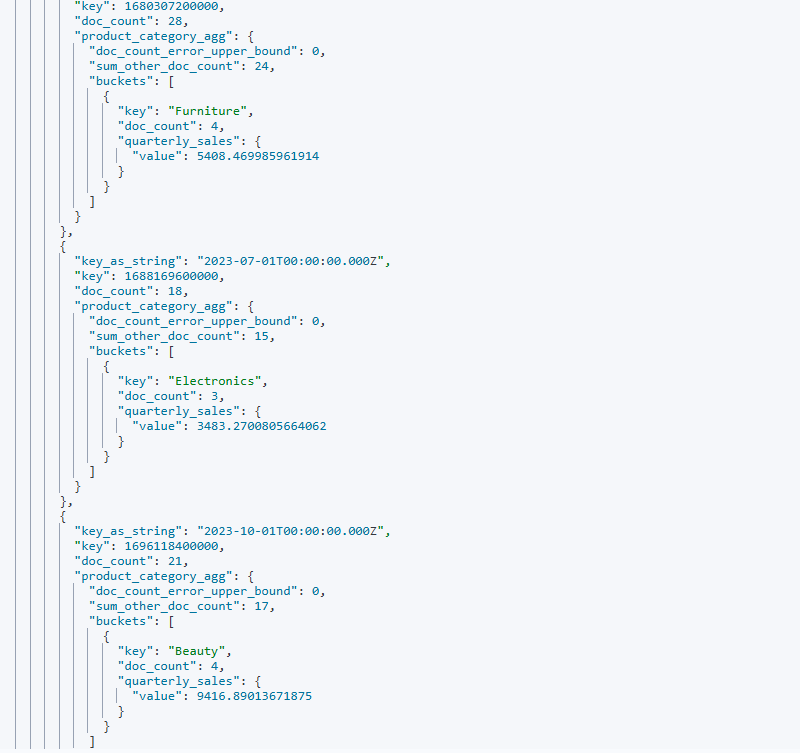

# 实验报告模板
    学院：省级示范性软件学院
    课程：高级数据库技术与应用
    题目：《 实验三：聚合操作练习》  
    姓名：蔡诗语  
    学号：2200770108
    班级：软工2202
    日期：2024-10-12
    实验环境： Elasticsearch
## 一、实验目的
1.理解数据结构与文档组织方式。  
2.掌握各类聚合功能及多阶段聚合。  
3.提升数据分析能力，解决实际问题。  
4.优化查询性能，避免性能瓶颈。  
## 二、实验内容
1. 统计每个产品类别的总销售额。

        GET ecommerce/_search
        {
            "size": 0,
            "aggs": {
                "product_categories": {
                    "terms": {
                        "field": "product_category",
                        "size": 10
                    },
                    "aggs": {
                        "total_sales": {
                            "sum": {
                                "field": "total_amount"
                            }
                        }
                    }
                }
            }
        }
结果：

2. 计算每个城市的平均订单金额。

         GET ecommerce/_search
         {
            "size": 0,
            "aggs": {
               "cities": {
                  "terms": {
                     "field": "customer_city",
                     "size": 10
                  },
                  "aggs": {
                     "average_order_amount": {
                        "avg": {
                           "field": "total_amount"
                        }
                     }
                  }
               }
            }
         }
结果：

3. 找出销量最高的前5个产品。

         GET ecommerce/_search
         {
            "size": 0,
            "aggs": {
               "top_products": {
                  "terms": {
                     "field": "product_name",
                     "size": 5,
                     "order": {
                        "_count": "desc"
                     }
                  },
                  "aggs": {
                     "total_quantity": {
                        "sum": {
                           "field": "quantity"
                        }
                     }
                  }
               }
            }
         }
结果：

4. 计算男性和女性客户的平均年龄。

         GET ecommerce/_search
         {
            "size": 0,
            "aggs": {
               "gender_aggregation": {
                  "terms": {
                     "field": "customer_gender",
                     "size": 2
                  },
                  "aggs": {
                     "average_age": {
                        "avg": {
                           "field": "customer_age"
                        }
                     }
                  }
               }
            }
         }
结果：

5. 统计每种支付方式的使用次数和总金额。

         GET ecommerce/_search
         {
            "size": 0,
            "aggs": {
               "payment_methods": {
                  "terms": {
                     "field": "payment_method",
                     "size": 10
                  },
                  "aggs": {
                     "usage_count": {
                        "cardinality": {
                           "field": "order_id"
                        }
                     },
                     "total_amount": {
                        "sum": {
                           "field": "total_amount"
                        }
                     }
                  }
               }
            }
         }
结果：

6. 计算每月的总销售额。

         GET ecommerce/_search
         {
            "size": 0,
            "aggs": {
               "monthly_sales": {
                  "date_histogram": {
                     "field": "order_date",
                     "calendar_interval": "month"
                  },
                  "aggs": {
                     "total_sales": {
                        "sum": {
                           "field": "total_amount"
                        }
                     }
                  }
               }
            }
         }
结果：

7. 找出平均订单金额最高的前3个客户。

         GET ecommerce/_search
         {
            "size": 0,
            "aggs": {
               "top_customers": {
                  "terms": {
                     "field": "customer_id",
                     "size": 3,
                     "order": {
                        "average_order_amount": "desc"
                     }
                  },
                  "aggs": {
                     "average_order_amount": {
                        "avg": {
                           "field": "total_amount"
                        }
                     }
                  }
               }
            }
         }
结果：

8. 计算每个年龄段（18-30，31-50，51+）的客户数量。

         GET ecommerce/_search
         {
            "size": 0,
            "aggs": {
               "age_groups": {
                  "range": {
                     "field": "customer_age",
                     "ranges": [
                        {
                           "from": 18,
                           "to": 30
                        },
                        {
                           "from": 31,
                           "to": 50
                        },
                        {
                           "from": 51
                        }
                     ]
                  },
                  "aggs": {
                     "customer_count": {
                        "cardinality": {
                           "field": "customer_id"
                        }
                     }
                  }
               }
            }
         }
结果：

9. 计算每个产品类别的平均单价。

         GET ecommerce/_search
         {
            "size": 0,
            "aggs": {
               "product_categories": {
                  "terms": {
                     "field": "product_category",
                     "size": 10
                  },
                  "aggs": {
                     "average_price": {
                        "avg": {
                           "field": "price"
                        }
                     }
                  }
               }
            }
         }
结果：

10. 找出订单数量最多的前5个城市。

         GET ecommerce/_search
         {
            "size": 0,
            "aggs": {
               "top_cities": {
                  "terms": {
                     "field": "customer_city",
                     "size": 5,
                     "order": {
                        "_count": "desc"
                     }
                  },
                  "aggs": {
                     "order_count": {
                        "cardinality": {
                           "field": "order_id"
                        }
                     }
                  }
               }
            }
         }
结果：

11. 计算每个季度的平均订单金额。

         GET ecommerce/_search
         {
            "size": 0,
            "aggs": {
               "quarterly_sales": {
                  "date_histogram": {
                     "field": "order_date",
                     "calendar_interval": "quarter"
                  },
                  "aggs": {
                     "average_order_amount": {
                        "avg": {
                           "field": "total_amount"
                        }
                     }
                  }
               }
            }
         }
结果：

12. 统计每个产品类别中的商品数量。

         GET ecommerce/_search
         {
            "size": 0,
            "aggs": {
               "product_categories": {
                  "terms": {
                     "field": "product_category",
                     "size": 10
                  },
                  "aggs": {
                     "product_count": {
                        "cardinality": {
                           "field": "product_id"
                        }
                     }
                  }
               }
            }
         }
结果：

13. 计算男性和女性客户的平均订单金额。

         GET ecommerce/_search
         {
            "size": 0,
            "aggs": {
               "gender_aggregation": {
                  "terms": {
                     "field": "customer_gender",
                     "size": 2
                  },
                  "aggs": {
                     "average_order_amount": {
                        "avg": {
                           "field": "total_amount"
                        }
                     }
                  }
               }
            }
         }
结果：

14. 找出总销售额最高的前10个日期。

         GET ecommerce/_search
         {
            "size": 0,
            "aggs": {
               "top_dates": {
                  "date_histogram": {
                     "field": "order_date",
                     "calendar_interval": "day"
                  },
                  "aggs": {
                     "total_sales": {
                        "sum": {
                           "field": "total_amount"
                        }
                     },
                     "top_hits_obj": {
                        "top_hits": {
                           "size": 10,
                           "_source": {
                              "includes": [
                                 "order_date"
                              ]
                           }
                        }
                     }
                  }
               }
            }
         }
结果：（该结果较多只展示部分）

15. 计算每个季度销售额最高的产品类别。

         GET ecommerce/_search
         {
            "size": 0,
            "aggs": {
               "quarterly_agg": {
                  "date_histogram": {
                     "field": "order_date",
                     "calendar_interval": "quarter"
                  },
                  "aggs": {
                     "product_category_agg": {
                        "terms": {
                           "field": "product_category",
                           "size": 1
                        },
                        "aggs": {
                           "quarterly_sales": {
                              "sum": {
                                 "field": "total_amount"
                              }
                           }
                        }
                     }
                  }
               }
            }
         }
结果：

16. 计算每天的订单数量，并显示7天移动平均值。（部分截图）

         POST /ecommerce/_search
         {
            "size": 0,
            "aggs": {
               "orders_per_day": {
                  "date_histogram": {
                     "field": "order_date",
                     "calendar_interval": "day"
                  },
                  "aggs": {
                     "total_orders": {
                        "sum": {
                           "script": {
                              "source": "1",
                              "lang": "painless"
                           }
                        }
                     },
                     "seven_day_moving_average": {
                        "moving_fn": {
                           "buckets_path": "total_orders",
                           "window": 7,
                           "script": "MovingFunctions.unweightedAvg(values)"
                        }
                     }
                  }
               }
            }
         }
结果：

17. 比较本月销售额与上月销售额的差异。

         GET ecommerce/_search
         {
            "size": 0,
            "aggs": {
               "monthly_sales_comparison": {
                  "date_histogram": {
                     "field": "order_date",
                     "calendar_interval": "month"
                  },
                  "aggs": {
                     "current_month_sales": {
                        "sum": {
                           "field": "total_amount"
                        }
                     },
                     "previous_month_sales": {
                        "filter": {
                           "range": {
                              "order_date": {
                                 "gte": "now-2M/M",
                                 "lt": "now-1M/M"
                              }
                           }
                        },
                        "aggs": {
                           "prev_month_sum": {
                              "sum": {
                                 "field": "total_amount"
                              }
                           }
                        }
                     },
                     "sales_difference": {
                        "bucket_script": {
                           "buckets_path": {
                              "currentMonthSales": "current_month_sales",
                              "previousMonthSales": "previous_month_sales>prev_month_sum"
                           },
                           "script": "return params.currentMonthSales - params.previousMonthSales;"
                        }
                     }
                  }
               }
            }
         }
结果：

18. 计算每周的总销售额，并找出销售额增长最快的一周。

         POST /ecommerce/_search
        {
            "size": 0,
            "aggs": {
                "sales_per_week": {
                    "date_histogram": {
                        "field": "order_date",
                        "calendar_interval": "week"
                    },
                    "aggs": {
                        "weekly_sales": {
                            "sum": {
                                "field": "total_amount"
                            }
                        },
                        "sales_growth": {
                            "derivative": {
                                "buckets_path": "weekly_sales"
                            }
                        }
                    }
                },
                "max_sales_growth": {
                    "max_bucket": {
                        "buckets_path": "sales_per_week>sales_growth"
                    }
                }
            }
        }
结果：

